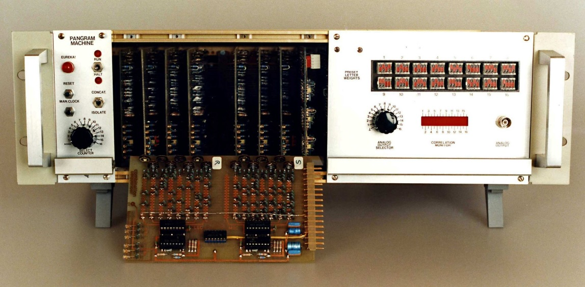

# Pangram Machine

A software implementation of Lee Sallows' Pangram Machine from his paper
'[In Quest of Pangram](https://www.leesallows.com/files/In%20Quest%20of%20a%20Pangram1.pdf)'.
This repository contains an interactive Rust program that implements the
algorithm his Mark II machine is based on. It is able to exhaust the narrowed
search space in around 13.5 seconds on one core of my Apple M1 using SIMD
optimisations.



## Example Usage

Here is an example of running the machine for the bimagic solution described on
page 22 of the paper:

```
$ cargo +nightly run --release

Enter intial text: This autogram contains and
Initial constants: [5, 1, 2, 2, 8, 2, 2, 2, 4, 1, 1, 1, 2, 10, 12, 1, 1, 2, 7, 7, 2, 2, 4, 1, 1, 1]

Running Pangram Machine Mark II...
EUREKA! [5, 1, 2, 2, 26, 6, 2, 4, 13, 1, 1, 1, 2, 21, 16, 1, 1, 5, 27, 20, 3, 6, 9, 5, 5, 1]
This autogram contains five a's, one b, two c's, two d's, twenty-six e's, six f's, two g's, four h's, thirteen i's, one j, one k, one l, two m's, twenty-one n's, sixteen o's, one p, one q, five r's, twenty-seven s's, twenty t's, three u's, six v's, nine w's, five x's, five y's and one z.

EUREKA! [5, 1, 2, 2, 31, 5, 5, 8, 12, 1, 1, 2, 2, 18, 16, 1, 1, 6, 27, 21, 3, 7, 8, 3, 4, 1]
This autogram contains five a's, one b, two c's, two d's, thirty-one e's, five f's, five g's, eight h's, twelve i's, one j, one k, two l's, two m's, eighteen n's, sixteen o's, one p, one q, six r's, twenty-seven s's, twenty-one t's, three u's, seven v's, eight w's, three x's, four y's and one z.

Finished 6273179136 iterations in 13.41 seconds which is equivalent to 467.9 MHz.
```

## License

MIT
